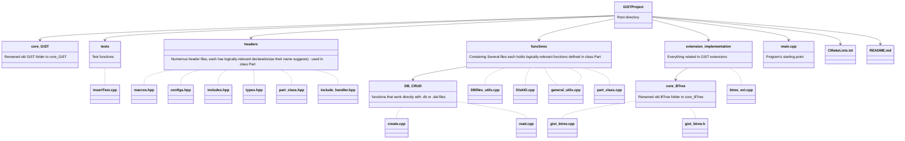

# GiSTProject - Standalone GiST search tree (Disk presistant) based on libgist V2.0 by University of California, Berkeley
-------------------------------------------------------------------------------------------------------------------------
> [!IMPORTANT]  
> The new directory hierarchy has taken place since #3 issue (on Github).
> You must follow this structure when contributing to this repository as the purpose of each directory and file described below:
 
### Diagram view:

### Table view:
Files inside GiSTProject (root directory):
| Depth | Name | Functions/Content | Description |
| :---: | :--: | :-------: | :---------: |
| 0 | `CMakeLists.txt` | * | CMake file |
| 0 | `main.cpp` | `myPrintPredFct()`, `myPrintDataFct()`, `intTest()`, `rand_string()`, `stringTest()`, `main()` | CMake file |
| 0 | `README.md` | * | This README file |
| 0 | core_GiST | DIR | Renamed old GiST folder to core_GiST |
| 0 | extension_implementation | DIR | Everything related to GiST extensions |
| 0 | functions | DIR | Containing Several files, each holds logically-relevant functions defined in `class Part` |
| 0 | headers | DIR | Numerous header files, each has logically-relevant declarations (as their name suggests) used in `class Part` |
| 0 | tests | DIR | Containing `.cpp` files holding test functions |
| 1 | extension_implementation/**core_BTree** | DIR | Renamed old BTree folder to core_BTree |
| 1 | extension_implementation/**`btree_ext.cpp`** | `Part::compareBins()` | Holding definition of `Btree_ext` objects *TODO |
| 1 | functions/**DB_CRUD** | DIR | Files with functions performing CRUD operations on `.db` or `.dat` files, reside here |
| 2 | functions/DB_CRUD/**`create.cpp`** | `Part::insertRecord()`, `Part::insertTerm()`, `Part::insertId()` | Functions resulting or relevant to creating a `.db` or `.dat` file |
| 2 | functions/DB_CRUD/**`read.cpp`** | `Part::findKey()`, `isKeyExist(2 params)`, `isKeyExist(3 params)` | Functions resulting or relevant to reading a `.db` or `.dat` file |
| 1 | functions/**`DBfiles_utils.cpp`** | `Part::printAllKeys()`, `Part::importCSV()`, `Part::loadGists()`, `Part::dropGists()` | Utility functions manipulating a `.db` or `.dat` file |
| 1 | functions/**`general_utils.cpp`** | `Part::checkAndRemoveIlligalChar()`, `Part::hashFileName()`, `Part::hexStrToBin()`, `Part::binToHexStr()`, `Part::extractKeyValue()` | General utility and helper functions speeding up different operations |
| 1 | functions/**`DiskIO.cpp`** | `Part::openFile()`, `Part::openFileV2()`, `Part::readPostingFile()`, `Part::closePostingFd()`, `Part::findFiles()`, `Part::getPostingFileHandle()`, `Part::getPostingFileHandleForWrite()`, `Part::getPostingFileHandleForRead()` | Functions directly work with dist IO |
| 1 | functions/**`part_class.cpp`** | `Part::Part()` | Every definition that directly related to `class Part` it's own |
| 1 | headers/**`macros.hpp`** | `#define _GNU_SOURCE 1` | Macros needed by `c/c++` language or compiler |
| 1 | headers/**`configs.hpp`** | `#define PAGING_COUNT 512`, `#define RECORD_SIZE 16` etc. | Macros used as configurable values, changing program's behavior and/or performance |
| 1 | headers/**`includes.hpp`** | `#include <fcntl.h>`, `#include "../core_GiST/gist.h"`, `#include <QDir>` etc. | `#include` lines needed by other files, maily by **functions** directory's files |
| 1 | headers/**`types.hpp`** | `struct UUID{}`, `struct FileStateManager{}` | Struct and type declarations by other parts of program |
| 1 | headers/**`part_class.hpp`** | Multiple function and object declarations | Declarations of functions and objects defined as members of `class Part` |
| 1 | headers/**`include_handler.hpp`** | `#include "macros.hpp"`, `#include "configs.hpp"`, `#include "includes.hpp"` etc. | Unified header file to be included by `.cpp` files for the ease of use, along with manageability |
| 1 | tests/**`insertTest.cpp`** | `Part::testInserts()` | Functions that perform insertion test into the tree |
